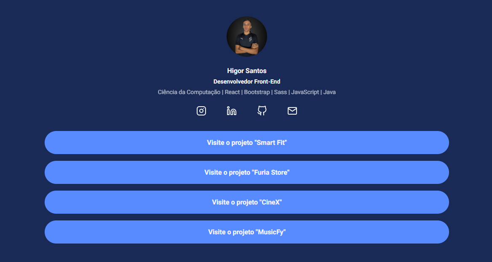

<h1 align="center">
  Social Links
</h1>

## 📷 Deploy

<h3>LINK: https://less-social-links.vercel.app/</h3>

## 💻 Projeto

Neste projeto realizado em aula, pratiquei o uso do Less criando uma página de links no estilo do Linktree.

## 🚀 Tecnologias

- Less
- CSS
- HTML

## 📝 Aprendizados

- [x] Escapings
- [x] Mixins
- [x] Maps
- [x] Variáveis